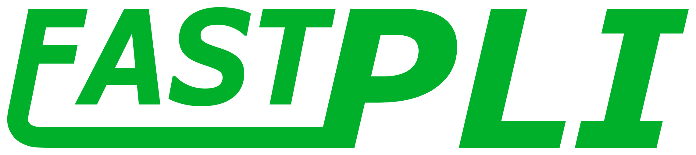

<!-- 
________             ___________________________
___  __/_____ _________  /___  __ \__  /____  _/
__  /_ _  __ `/_  ___/  __/_  /_/ /_  /  __  /  
_  __/ / /_/ /_(__  )/ /_ _  ____/_  /____/ /   
/_/    \__,_/ /____/ \__/ /_/     /_____/___/    
-->


# Fiber Architecture Simulation Toolbox for PLI

## Basic Information:
`fastpli` is a Python package consisting of the following modules

| module                  | information                                                  |
| ----------------------- | ------------------------------------------------------------ |
| `fastpli.analysis`      | analysis of 3D-PLI results                                   |
| `fastpli.model.sandbox` | building of simple 3d nerve fiber models                     |
| `fastpli.model.solver`  | generation of non intersection nerve fiber models            |
| `fastpli.objects`       | manipulation of fastpli objects (e.g. rotation)              |
| `fastpli.tools`         | mathematical tools and helper function                       |
| `fastpli.simulation`    | simulation of fiber models inside a virtual 3D-PLI microscop |

The aim of this package is to provide consistent system that allows the following: 
* **model** 3d (non colliding) nerve fibers
* **simulate** nerve fiber inside a virtual tiltable 3D-PLI microscop
* **analyse** the simulated signals to extract the resulting fiber orientation

All computationally intensive calculations are optimized either with **numba** on the Python side or with multithreading **c++**, which can be accessed via **pybind11**. Additionally the simulation module supports the **Message Passing Interface (MPI)**.


## Installation:
```sh
# Compiling the source code and generating setup.py
make build

# installation with pip
pip3 install build/.
```

## Running examples:

```sh
# install required modules for examples
pip3 install -r examples/requirements.txt

# run examples
python3 examples/sandbox.py
python3 examples/model_solver.py
python3 examples/simpli.py
python3 examples/simulation_pipeline.py
```

[detailed examples](docs/examples.md)

## Running tests
```sh
make test
```

# Dependencies
## Requirements:
 - C++
 - Make
 - CMake
 - Python3
 - MPI

## Optional Packages:
 - OpenGL
 - CUDA

## Submodules:
 - pybind11

# MPI execution:
The PLI simulation library simPLI supports mpi.

## Volume generation:
The generated volume will be splitt corresponding to the mpi processes. Each mpi process calculates the label_field and vector_field volume seperatly.

## PLI simulation:
Each mpi process simulates the light-tissue interaction on its volume. When a light beam needs to change to a neighboured volume, it is transmitted via mpi communication.

## Parallel HDF5io:
To be able to save the seperated data into a single hdf5 file, a paralel implementation of h5py is needed. However, a parallel installation of h5py is required. However, h5py can only be installed either serially or in parallel:
```sh
# serial:
make h5py-serial

# parallel:
make h5py-mpi

# clean:
h5py-clean
```

## example:
```sh
# simpli supports mpi 
mpiexec -n 2 python3 examples/simpli_mpi.py
```

# Additional Informations:
[program structure](docs/structure.md)

## TODOs:
[TODOs](TODO.md)


---
## Authors
* **Felix Matuschke**: INM1 - Forschungszentrum Jülich

## References
[Fiber Architecture (FA)](https://www.fz-juelich.de/inm/inm-1/EN/Forschung/Fibre%20Architecture/Fibre%20Architecture_node.html)

## License
This project is licensed under the GPLv3 License - see the [LICENSE](LICENSE) file for details
