[back](../README.md)
# Examples

## Requirements:
```sh
pip3 install -r examples/requirements.txt
```

## Sandbox:
#### fiber bundle from trajectory and seed points
```python
import numpy as np
import fastpli.model.sandbox as sandbox

# define seed points for fibers inside a fiber bundle
seeds = sandbox.seeds.triangular_grid(a=42, b=42, spacing=4, center=True)

# crop seed points into a circular shape
circ_seeds = sandbox.seeds.crop_circle(radius=21, seeds=seeds)

# define a fiber bundle trajectory
t = np.linspace(0, 2 * np.pi, 50, True)
traj = np.array((20 * t, np.cos(t), np.zeros(t.size))).T

# fill fiber bundle from seed points with variable radii and scaling
fiber_bundle = sandbox.build.bundle(traj=traj,
                                    seeds=circ_seeds,
                                    radii=np.random.uniform(
                                        0.5, 0.8, circ_seeds.shape[0]),
                                    scale=2 + 0.5 * np.sin(t))
```
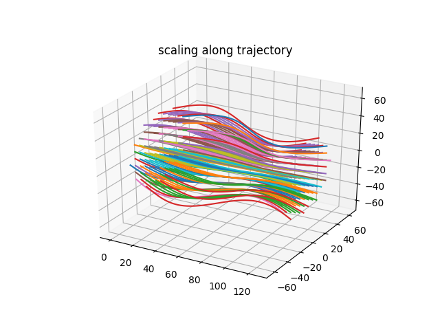


#### fiber bundle of cylindrig shap
```python
import numpy as np
import fastpli.model.sandbox as sandbox

seeds = sandbox.seeds.triangular_grid(a=200, b=200, spacing=5, center=True)
fiber_bundle = sandbox.build.cylinder(
    p=(0, 80, 50),
    q=(40, 80, 100),
    r_in=20,
    r_out=40,
    seeds=seeds,
    radii=1,
    alpha=np.deg2rad(20),
    beta=np.deg2rad(160),
    mode='radial'  # 'circular', 'parallel'
)
```
| radial               | circular             | parallel             |
| -------------------- | -------------------- | -------------------- |
| 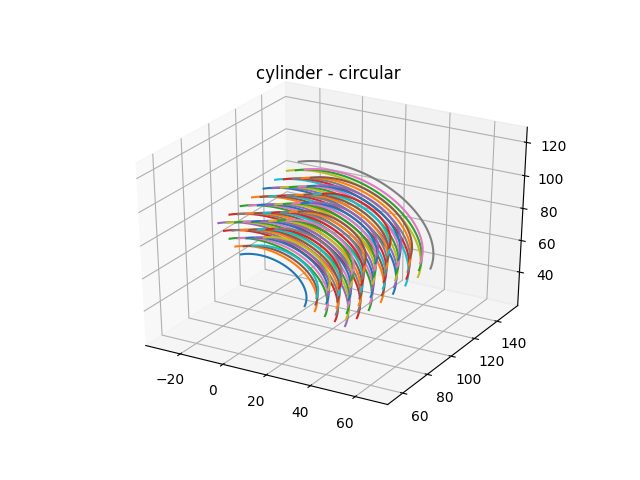 | 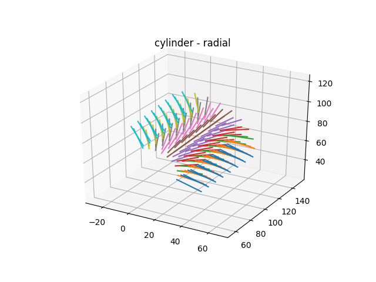 | 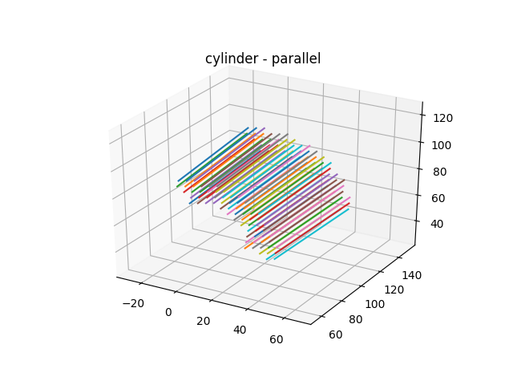 |


#### fiber bundle of cubic shape
```python
import numpy as np
import fastpli.model.sandbox as sandbox

# create seed points which can fill an entire cube
p = np.array([0, 80, 50])
q = np.array([40, 180, 100])
d = np.max(np.abs(p - q)) * np.sqrt(3)
seeds = sandbox.seeds.triangular_grid(a=d, b=d, spacing=5, center=True)

# fill a cube with (theta, phi) directed fibers
fiber_bundle = sandbox.build.cuboid(p=p,
                                    q=q,
                                    phi=np.deg2rad(45),
                                    theta=np.deg2rad(90),
                                    seeds=seeds,
                                    radii=1)
```
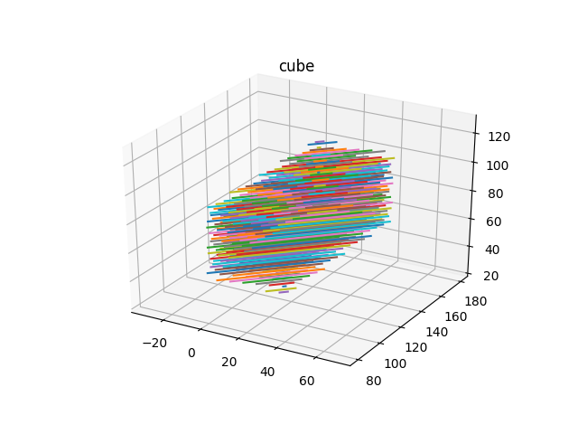

## Solver:
#### solving collision of fibers inside a fiber bundle
```python
import fastpli.solver

# setup solver
solver = fastpli.model.solver.Solver()
solver.fiber_bundles = [fiber_bundle]

# run solver 
for i in range(1000):
    solved = solver.step()

    if i % 10 == 0:
        solver.draw_scene()

    if solved:
        break
```
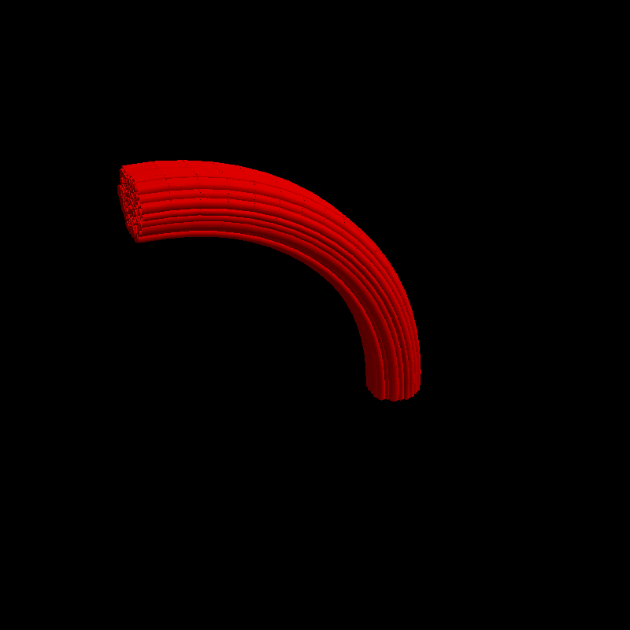


## Simpli:
#### 
```python
import fastpli.simulation
import fastpli.io
import numpy as np

# Setup Simpli for Tissue Generation
simpli = fastpli.simulation.Simpli()
simpli.omp_num_threads = 2
simpli.voxel_size = 1  # in mu meter
simpli.set_voi([-100, -100, -25], [2350, 550, 25])  # in mu meter

simpli.fiber_bundles = fastpli.io.fiber_bundles.load('fastpli.dat')
simpli.fiber_bundles_properties = [[(1, -0.001, 10, 'p')]]

# generate discretised tissue
label_field, vec_field, tissue_properties = simpli.generate_tissue()

# Simulate PLI Measurement
simpli.filter_rotations = np.deg2rad(np.linspace(0, 180, 18 * 1))
simpli.light_intensity = 1  # a.u.
simpli.interpolate = True
simpli.wavelength = 525  # in nm
simpli.resolution = 10  # in mu meter
simpli.sensor_gain = 3
simpli.optical_sigma = 0.71  # in voxel size
simpli.tilts = np.deg2rad([(0, 0), (5.5, 0), (5.5, 90), (5.5, 180),
                           (5.5, 270)])

tilting_stack = [None] * 5
for t, (theta, phi) in enumerate(simpli.tilts):
   images = simpli.run_simulation(label_field, vec_field,
                                 tissue_properties, theta, phi)

   # apply optic to simulation
   images = simpli.apply_optic(images)
   tilting_stack[t] = images

   # calculate modalities
   transmittance, direction, retardation = simpli.apply_epa(images)

# analyse tilting measurements
direction, incl, t_rel, _ = simpli.apply_rofl(tilting_stack)

# generate FOM
img = fastpli.analysis.images.fom_hsv_black(rofl_direction, rofl_incl)
```

#### simulation of PLI measurement
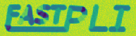

| transmittance                 | direction                 | retardation                 |
| ----------------------------- | ------------------------- | --------------------------- |
| 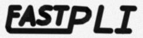 |  | 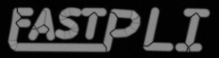 |

| rofl direction                 | rofl inclination                 | rofl trel                 |
| ------------------------------ | -------------------------------- | ------------------------- |
|  | 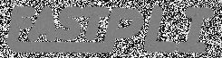 |  |

#### resulting fiber orientation map
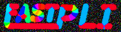
