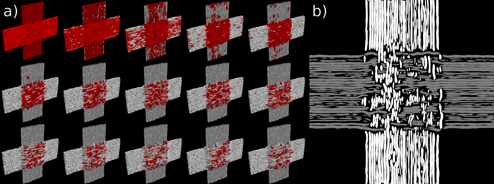
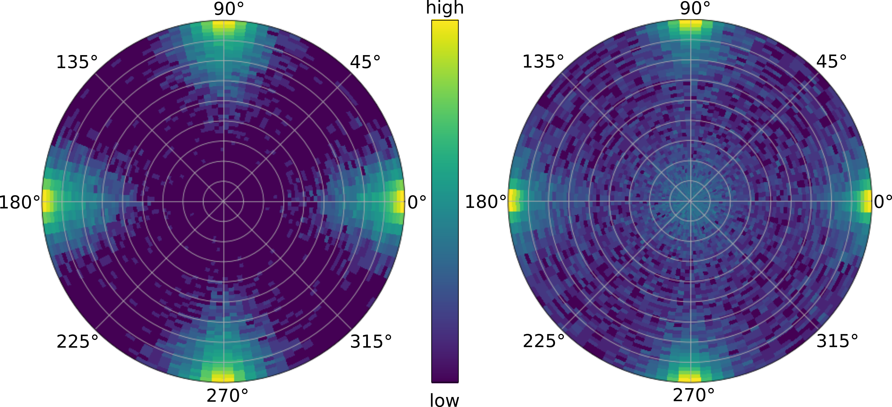
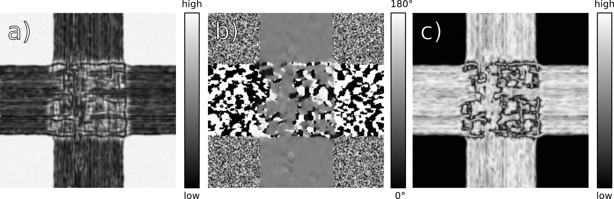
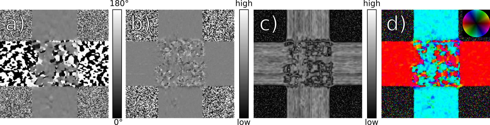

# Summary

*fastPLI* is an open source toolbox based on Python for modeling myelinated axons, i.e. nerve fibers and simulating the results of measurement of fiber orientations with a polarization microscope using 3D-PLI [@Axer2011].
In addition, the toolbox provides functions for further analysis of the results and helpful additional helpful features.

3D-PLI is a microscopic neuroimaging technique used to study the nerve fiber architecture in unstained histological brain sections at the micrometer scale.
It allows to give contrast to fibers and fiber tracts and, ultimately, reconstruct 3D nerve fiber orientations.
The physical effect behind 3D-PLI is the optical property of the nerve fibers called birefringence.
Due to this intrinsic birefringence, it is possible to use polarized light, pass it through a thin brain section and observe the change of the polarization state of light.
This change is directly related to the 3D orientation of the fibers and also provides strong contrasts between fibers and other tissue components.

This *fastPLI* package includes the following modules:

1) **Fiber Modelling Modules:**
    A detailed 3D modelling of nerve fibers at the micrometer level is essential as input for the measurement simulation.
    In order to recreate biological tissue as a model, it is important that the nerve fibers do not spatially overlap.
    We have decided to implement a solver module that takes any configuration of fiber bundles as input and converts it over several iterations into an collision-free configuration.
    In order to generate collision free fiber arrangements, a dedicated algorithm to prohibit such overlaps has been developed [@Matuschke2019].

2) **Simulation Module:**
    The 3D-PLI simulation is based on Stokes vector and Müller matrix approaches as described in [@Dohmen2015; @Menzel2015].
    For the simulation the polarimetric setup can be equipped with a tiltable specimen stage [@Axer2011; @Schmitz2018].
    By this means the brain section can be scanned from oblique views which adds important information to unambiguously analyze the 3D fiber orientation.

3) **Analysis Module:**
    The resulting simulated measurements (i.e., image stacks of a section acquired at different polarizing filter rotation angles and, optionally, at different oblique views) can be processed in a similar way as the real, experimental 3D-PLI [@Axer2011; @Schmitz2018].

All computationally intensive calculations are optimized either with *numba* on the Python side or with multithreading *C++* algorithms, which can be accessed via *pybind11* inside the Python package [@Lam2015;@pybind11].
Additionally, the simulation module supports the Message Passing Interface (MPI) to facilitate the simulation of very large volumes on multiple computer nodes.

# Installation

The *fastPLI* package has to be built with a *C++17* compiler.
A Makefile allows a simple local installation.
It generates the necessary libraries inside a build folder and a matching setup.py file, which can be used for a second installation process with pip.

```sh
make fastpli
pip3 install .
```

All necessary configurations are handled in the background with CMake.
All required software libraries are listed in the [software repository](https://github.com/3d-pli/fastpli).

# Usage & Examples

A more detailed description of *fastPLI* including examples [^1] can be found in the software package and at the wiki pages [^2].

[^1]: [https://github.com/3d-pli/fastpli](https://github.com/3d-pli/fastpli/tree/master/examples)
[^2]: [https://github.com/3d-pli/fastpli/wiki](https://github.com/3d-pli/fastpli/wiki)

```sh
python3 examples/sandbox.py
python3 examples/solver.py
python3 examples/simpli.py
python3 examples/crossing.py
```

## Fiber Modelling

Two modules exist to allow the user to build non-colliding white matter nerve fiber models: `fastpli.model.sandbox` and `fastpli.model.solver`.

The `fastpli.model.sandbox` module contains multiple functions to build from coordinates single individual fibers up to fiber bundles composed of individual fibers.

The `fastpli.model.solver` module contains a `Solver` class to generate non-colliding fibers constellations from an initial input dataset [@Matuschke2019].

An example of the solving process is shown in fig. \ref{generation} a).
The red colored segments indicate that a collision with this segment is detected.
With further iterations, the number of collisions decreases.
At the end, a collision-free configurations results.
Figure \ref{generation} b) shows the cross section trough the resulting fiber configuration.
Each fiber bundle has a different gray value.

{width=100%}

The resulting orientations for each segment can be then visualized in a polar histogram (see fig. \ref{orientation}).

{width=100%}

## Simulation and Analysis

The module `fastpli.simulation` contains the class `Simpli`.
This class contains all tools required to simulate the 3D-PLI setup [@Dohmen2015; @Menzel2015] and to analyze the generated images.
Final results include the stack of images as well as the derived modalities referred to as transmittance, direction, retardation, inclination, relative thickness, and 3D fiber orientation (FOM) maps [@Schmitz2018].

An example of the simulation results is shown in fig. \ref{crossingmodalities}.
a) indicates the resulting transmittance map.
It represents the mean light intensity transmission through the cut tissue.
b) represents the fiber direction in the tissue plane.
c) shows the resulting retardation, which is a measure of the amplitude of the resulting sinusoidal signal from the simulation in each pixel.

{width=100%}

The data can be further analyzed with an advanced tilting simulation and analysis \ref{crossingrofl}.
a) represents the fiber direction in the tissue plane.
b) visualizes the fiber inclination in the tissue plane.
c) shows the relative thickness of the fibers within a pixel volume.
d) represents the resulting FOM. The colors encode the 3D orientation.

{width=100%}

The analysis is accessable inside the simulation module via a *pipeline* inside the `fastpli.simulation.Simpli` class. For further informations see `examples/simulation_pipeline.py`.

# Acknowledgements

This study was funded by the European Union's Horizon 2020 Research and Innovation Programme under Grant Agreement No. 785907 (Human Brain Project SGA2) and No. 945539 (Human Brain Project SGA3).
We gratefully acknowledge the computing time granted through JARA-HPC on the supercomputer JURECA [@Krause2016] at Forschungszentrum Jülich, Germany.

# Author Contributions

F.M. developed the software and wrote the documentation.
M.A. provided guidance throughout the project.
K.A. and M.A. supervised the project.
F.M. wrote the manuscript with input from all authors.

# References
